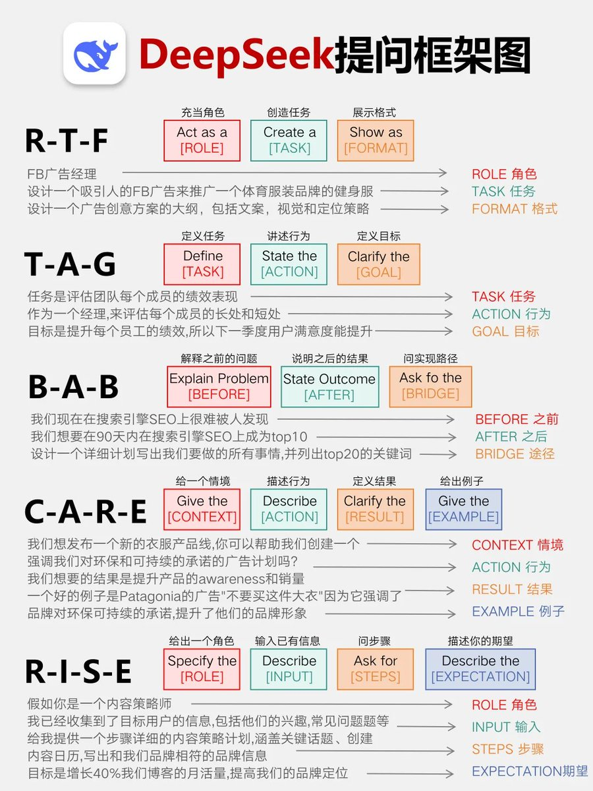

# DeepSeek提问框架文档

## R-T-F (角色-任务-格式)

### 组成部分
- **ROLE 角色**：Act as a [ROLE]
- **TASK 任务**：Create a [TASK]
- **FORMAT 格式**：Show as [FORMAT]

### 应用示例
- **ROLE 角色**：FB广告经理
- **TASK 任务**：设计一个吸引人的FB广告来推广一个体育服装品牌的健身服
- **FORMAT 格式**：设计一个广告创意方案的大纲，包括文案、视觉和定位策略

## T-A-G (任务-行动-目标)

### 组成部分
- **TASK 任务**：Define [TASK]
- **ACTION 行动**：State the [ACTION]
- **GOAL 目标**：Clarify the [GOAL]

### 应用示例
- **TASK 任务**：任务是评估团队每个成员的绩效表现
- **ACTION 行动**：作为一个经理，来评估每个成员的长处和短处
- **GOAL 目标**：目标是提升每个成员工作绩效，所以下一季度用户满意度能提升

## B-A-B (之前-之后-连接)

### 组成部分
- **BEFORE 之前**：Explain Problem [BEFORE]
- **AFTER 之后**：State Outcome [AFTER]
- **BRIDGE 连接**：Ask for the [BRIDGE]

### 应用示例
- **BEFORE 之前**：我们现在在使用引擎SEO上很难被人发现
- **AFTER 之后**：我们想要在90天内在搜索引擎SEO上成为top10
- **BRIDGE 连接**：设计一个详细计划与出发点，告诉我们的所有事情，并列出top20的关键词

## C-A-R-E (情境-行动-结果-例子)

### 组成部分
- **CONTEXT 情境**：Give the [CONTEXT]
- **ACTION 行动**：Describe [ACTION]
- **RESULT 结果**：Clarify the [RESULT]
- **EXAMPLE 例子**：Give the [EXAMPLE]

### 应用示例
- **CONTEXT 情境**：我们想发布一个新的衣服产品线，你可以帮助我们创建一个
- **ACTION 行动**：告诉我们对环保和可持续的衣服的广告计划是什么？
- **RESULT 结果**：我们想要的结果是提升产品的awareness和销量
- **EXAMPLE 例子**：一个好的例子是Patagonia的广告"不要买这件大衣"因为它强调了品牌对环保可持续的承诺，提升了他们的品牌形象

## R-I-S-E (角色-输入-步骤-期望)

### 组成部分
- **ROLE 角色**：Specify the [ROLE]
- **INPUT 输入**：Describe [INPUT]
- **STEPS 步骤**：Ask for [STEPS]
- **EXPECTATION 期望**：Describe the [EXPECTATION]

### 应用示例
- **ROLE 角色**：假如你是一个内容策略师
- **INPUT 输入**：我已经收集到了目标用户的信息，包括他们的兴趣，常见问题题库等
- **STEPS 步骤**：给我提供一个步骤详细的内容策划，包括如何突破流量瓶颈，内容日历，与出和我们品牌相符的品牌信息
- **EXPECTATION 期望**：目标是增长40%我们感兴趣的月活量，提高我们的品牌定位

## 使用建议

### 选择合适的框架
- 当你需要扮演特定角色执行特定任务时，使用 **R-T-F**
- 当你需要明确任务、行动和目标时，使用 **T-A-G**
- 当你面临问题并需要达到特定结果时，使用 **B-A-B**
- 当你需要提供完整情境及案例时，使用 **C-A-R-E**
- 当你需要明确角色和步骤以达到特定期望时，使用 **R-I-S-E**

### 实际应用
这些框架可以灵活组合使用，根据实际情况选择最适合的框架或组合多个框架的元素，以获得最准确和有用的回答。

## 提问框架图示

上图展示了这些提问框架的结构和关系，可以帮助您更直观地理解和应用这些框架。
